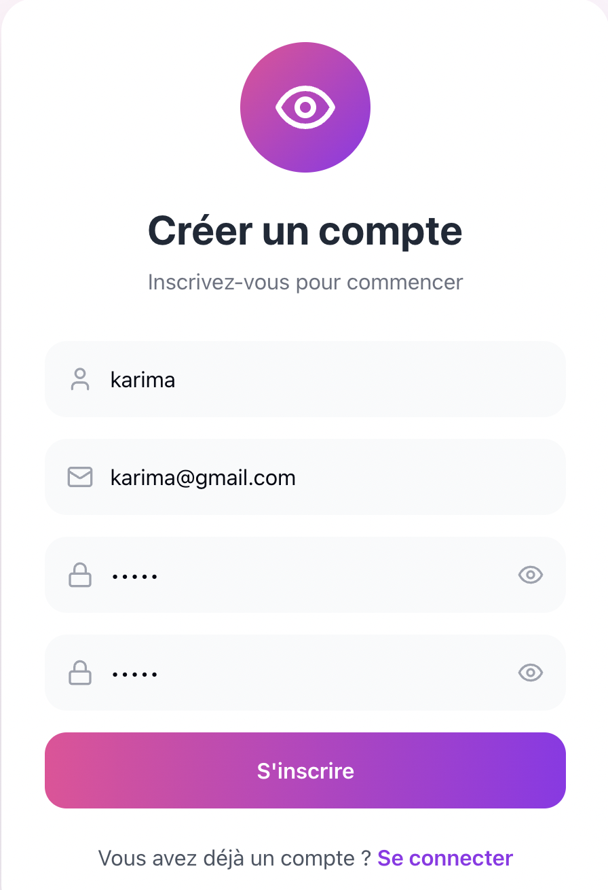
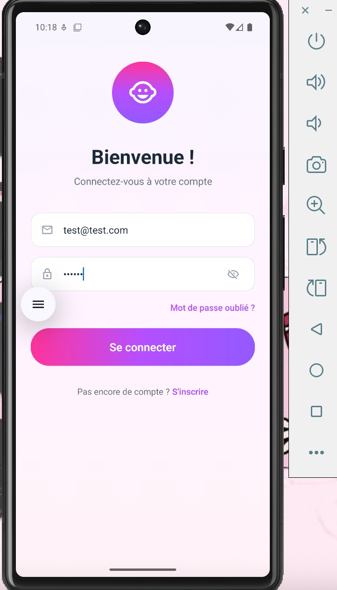

<<<<<<< HEAD

## 📸 Captures d'écran

### 1. Écran de Connexion


### 2. Écran d'Inscription


### 3. Dashboard Principal


*Les autres écrans sont en cours de développement*
=======
# Baby Tracker App 👶

## 📱 Description du Projet
Application mobile complète pour le suivi de croissance et développement des bébés. 
Permet aux parents de suivre quotidiennement l'alimentation, le sommeil, les vaccinations 
et les étapes de développement de leur bébé.

## 🏗️ Architecture
- **Backend** : API Laravel RESTful (`baby-tracker-api/`)
- **Frontend** : Application React Native (`suivibebe/`)

## 🚀 Installation Rapide

### 1. Backend (Laravel)
```bash
cd baby-tracker-api
composer install
cp .env.example .env
php artisan key:generate
php artisan migrate
php artisan serve

2. Frontend (React Native)
cd suivibebe
npm install
npx expo start

## 📸 Captures d'écran

 Écran de Connexion


 Écran d'Inscription


 Dashboard Principal


>>>>>>> 6ff67fa09203a7ddd4fee35c7c11ec418646e9fe
